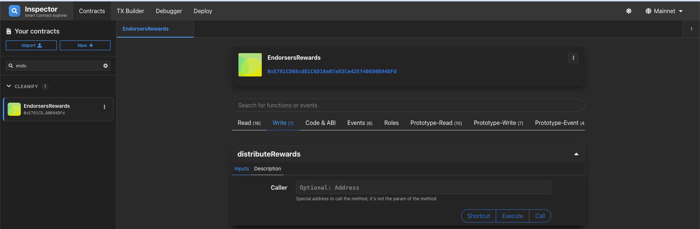
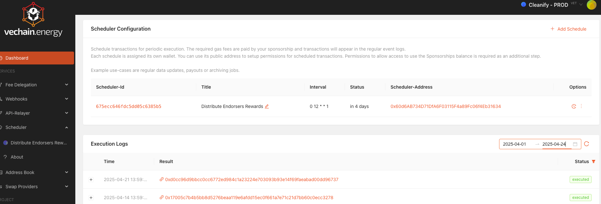

# X2Earn Endorsers Reward Distributor

A generic, upgradeable contract that any [VeBetterDAO](https://vebetterdao.org)
X2Earn app can deploy to share a fixed percentage of each round's app rewards
with its endorsers, weighted by the endorsement score of each endorser's
X-Node.

Rewards are distributed through the `X2EarnRewardsPool`, once per round, and
can be triggered permissionlessly (typically via a scheduled job — for example
on [vechain.energy](https://vechain.energy)).

## How it works

1. After an allocation round closes, anyone calls `distributeRewards()`.
2. The contract reads your app's earnings for that round from `XAllocationPool`.
3. It takes `rewardsPercentage` of those earnings as the endorser pool.
4. It fetches your app's endorsers from `X2EarnApps` and weights each share by
   that endorser's `getUsersEndorsementScore` (their X-Node tier).
5. It calls `X2EarnRewardsPool.distributeRewardDeprecated` once per endorser.

Rewards for a given round can only be distributed once.

## Deploying your own instance

### 1. Install

```bash
nvm use            # node v20
yarn install
```

### 2. Configure

```bash
cp .env.example .env
```

Edit `.env` and set at least:

- `MNEMONIC` — the deployer wallet
- `APP_ID` — your X2Earn app id (bytes32)
- `START_ROUND` — the last completed round you do NOT want included
- `REWARDS_PERCENTAGE` — share of each round's earnings to endorsers (0-100)

Optional:

- `ADMIN_ADDRESS`, `UPGRADER_ADDRESS`, `VET_DOMAIN_OWNER` — default to the
  deployer if not set. `VET_DOMAIN_OWNER` is the address returned by `owner()`
  and is used to claim a `.vet` subdomain for the contract.
- `ALLOCATION_VOTING_GOVERNOR`, `REWARDS_POOL`, `X2EARN_APPS`,
  `ALLOCATION_POOL` — mainnet and testnet defaults are baked into the deploy
  script. Only needed for solo / forks or to override.

### 3. Deploy

```bash
yarn deploy:mainnet     # or :testnet, :solo
```

The proxy address is printed at the end. Save it.

### 4. Authorize the contract as a reward distributor

In the VeBetterDAO X2Earn admin UI (or by calling `X2EarnApps` directly),
add the deployed proxy address as a reward distributor for your app. Without
this, `distributeRewards()` will revert.

### 5. Fund the rewards pool

The `X2EarnRewardsPool` must hold enough B3TR for your app to cover the
endorser share each round. Top it up the same way you do for any other reward
distribution.

### 6. Schedule distribution

Set up a job to call `distributeRewards()` once per round, after the previous
round closes. See [Interacting with the contract](#interacting-with-the-contract)
below.

## Interacting with the contract

Once deployed, you can read state and call `distributeRewards()` in a couple
of ways.

### Option 1 — VeChain Inspector (manual / one-off)

[inspector.vecha.in](https://inspector.vecha.in/) is a UI for any deployed
contract. Use it to manually trigger `distributeRewards()` or to inspect
state (`getRewardsPercentage`, `rewardsDistributed`, `getEndorsersAndScores`,
etc.).

1. Open [inspector.vecha.in](https://inspector.vecha.in/) and pick the
   network (Mainnet / Testnet) in the top right.
2. Click **Import** in the left sidebar → **select folder** → pick the
   `artifacts/` folder from this repo (run `yarn compile` first if you don't
   have one).
3. Choose **EndorsersRewardDistributor** from the list and paste your deployed
   proxy address.
4. The contract appears in the sidebar. Open the **Write** tab and call
   `distributeRewards` — or use **Read** to inspect any view function.



### Option 2 — vechain.energy Scheduler (automated)

[vechain.energy](https://vechain.energy) can call `distributeRewards()` on a
cron schedule and pay the gas via a sponsorship, so the function runs hands-off
every round.

1. Sign in to [vechain.energy](https://vechain.energy) and create a project.
2. Go to the **Scheduler** section and click **Add Schedule**.
3. Set:
   - **Title** — e.g. `Distribute Endorsers Rewards`
   - **Contract address** — your deployed proxy
   - **ABI / function** — `distributeRewards()`
   - **Interval** — a cron expression matching your round cadence (e.g.
     `0 12 * * 1` for weekly Mondays at 12:00 UTC)
4. Each scheduler is assigned its own wallet. Fund that wallet (and/or
   configure a Sponsorship) so it can pay for the transactions.
5. Execution logs appear in the dashboard once it starts running.



## Upgrading

```bash
PROXY_ADDRESS=0x... yarn upgrade:mainnet
```

The deployer must hold `UPGRADER_ROLE` on the proxy.

## Local development

Start a Thor-Solo node:

```bash
yarn start-solo
```

Compile, test, and deploy:

```bash
yarn compile
yarn test
yarn deploy:solo
```

Generate docs:

```bash
yarn generate-docs
```

## Admin operations

- `setRewardsPercentage(uint256)` — change the endorser share. `DEFAULT_ADMIN_ROLE`.
- `setVetDomainOwner(address)` — change the address returned by `owner()`.
  `DEFAULT_ADMIN_ROLE`.

## Compatibility

Built against OpenZeppelin Contracts `5.0.2` (upgradeable + non-upgradeable) to
match the VeChain Solidity compiler version `0.8.20`.

## License

MIT
